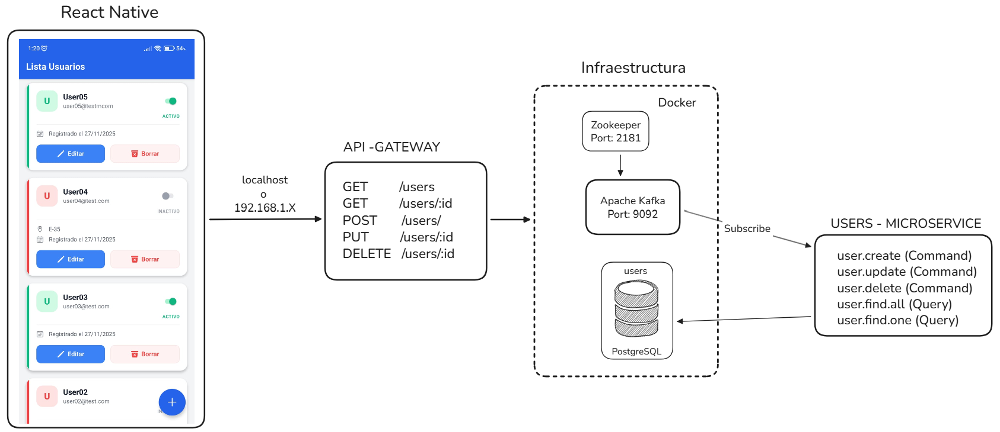

# Sistema de Gestión de Usuarios (Microservicios & Mobile)

Este repositorio contiene la configuración de infraestructura (Docker) y las instrucciones para desplegar la solución completa de la prueba técnica. La solución implementa una arquitectura de microservicios basada en eventos con NestJS, Kafka, DDD, CQRS y una aplicación móvil en React Native.

## 🏗 Arquitectura


## 📋 Prerrequisitos

* **Docker** y **Docker Compose**.
* **Node.js** (Versión LTS recomendada).
* **pnpm** (Para los servicios Backend).
* **npm** (Para la App Móvil).
* **Git**.

## 🚀 Guía de Instalación y Ejecución

Para ejecutar el proyecto correctamente, por favor sigue estos pasos en orden.

### 1. Preparación del Directorio de Trabajo

Se recomienda crear una carpeta raíz (por ejemplo, `prueba-jorge-rosero`) y dentro de ella clonar este repositorio y los tres repositorios de código fuente para que queden al mismo nivel.

Estructura de carpetas esperada:

```text
/carpeta-raiz
  ├── infrastructure-microservicio-users  <-- (Estás aquí)
  ├── api-gateway-users-microservicio-pt
  ├── users-microservicio-pt
  └── users-mobile-app-pt
```

### 2. Clonar los repositorios
Ejecuta los siguientes comandos en tu terminal dentro de tu `carpeta/raiz`
```
# 1. API Gateway
git clone https://github.com/DevJorgeRafael/api-gateway-users-microservicio-pt.git

# 2. Microservicio de Usuarios (DDD/CQRS)
git clone https://github.com/DevJorgeRafael/users-microservicio-pt.git

# 3. Aplicación Móvil
git clone https://github.com/DevJorgeRafael/users-mobile-app-pt.git
```

### 3. Levantar infraestructura (Base de Datos & Kafka)
Dentro de este directorio (`infrastructure-microservicio-users`), levnata los contenedores de Docker:
```
docker-compose up -d
```

### 4. Ejecutar los Servicios Backend (NestJS)

Ambos servicios utilizan `pnpm`. Abre nuevas terminales para cada servicio.

**Terminal A: Microservicio de Usuarios**
```bash
cd ../users-microservicio-pt
pnpm install
pnpm start:dev
```

### 5. Ejecutar la Aplicacion Móvil (React Native)
La aplicación móvil utiliza `npm`
**Terminal C: Mobile App**
```bash
cd ../users-microservicio-pt
pnpm install
pnpm start:dev
```